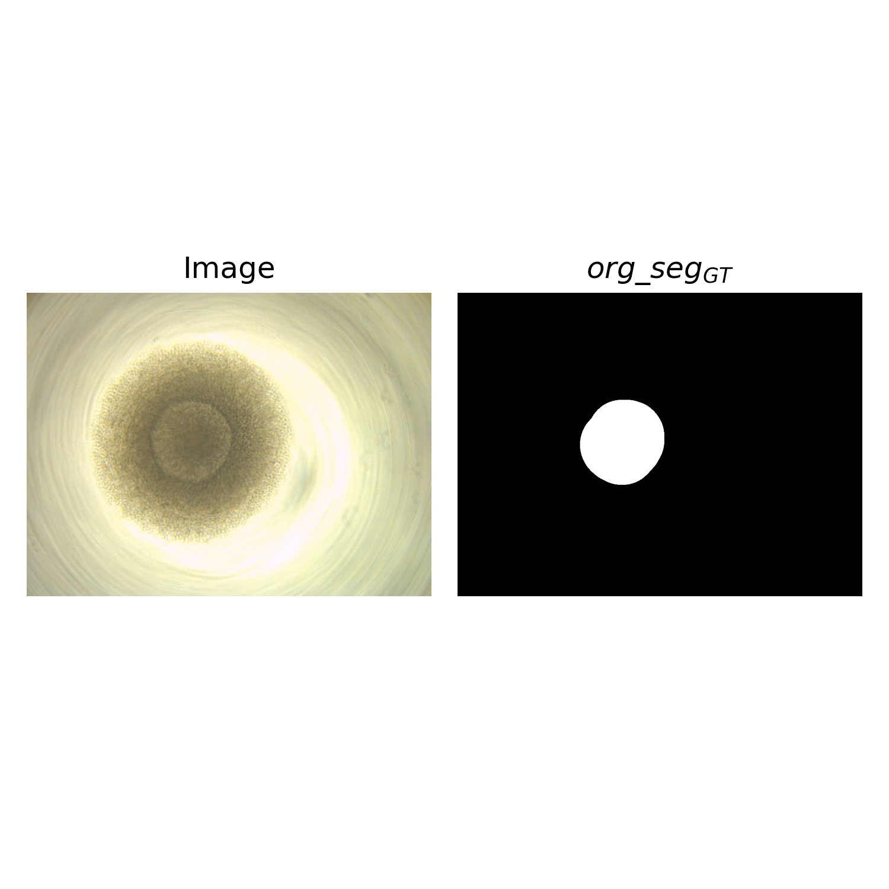
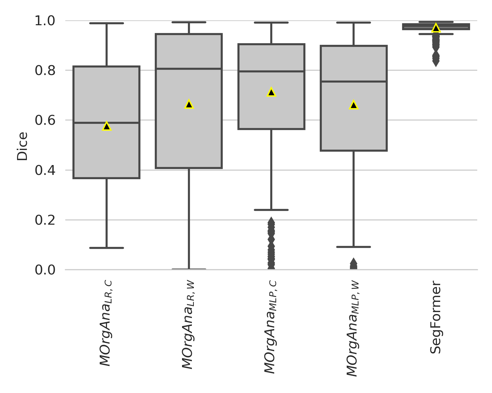
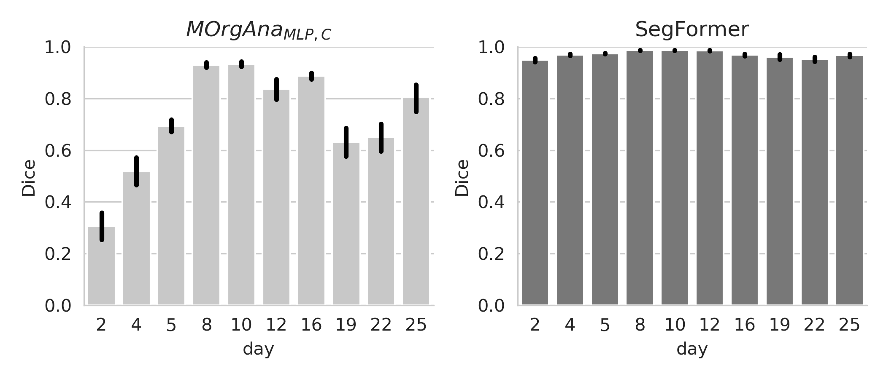
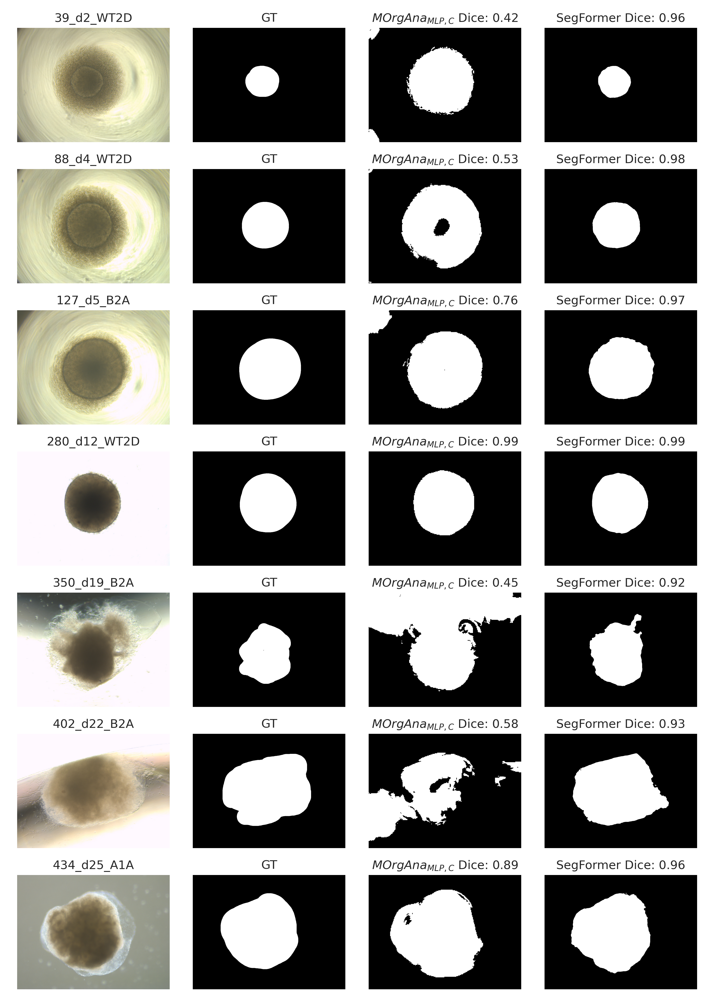
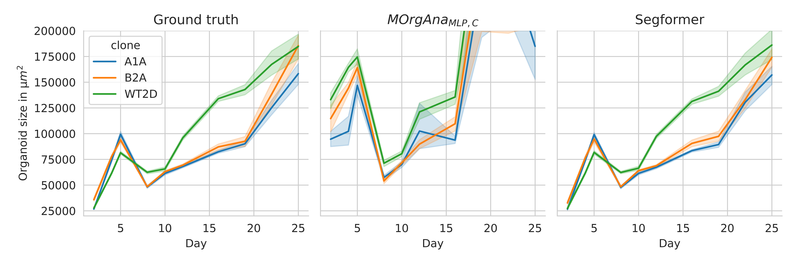
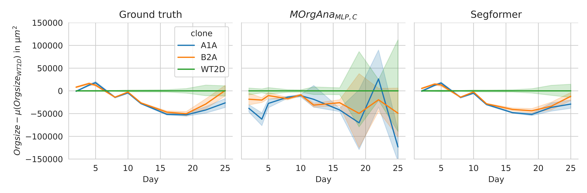

# A large brain organoid dataset for improving state-of-the-art analysis pipelines

This repository reproduces the results of the paper x

## Installation
```
git clone https://github.com/deiluca/robust_monitoring_organoid_growth
```
Install conda environment
```
cd path/to/robust_monitoring_organoid_growth
conda env create -f environment.yml
```

Activate the conda environment:

```
conda activate rob_monit_org_growth
```

## Data preparation

Download the data from [Zenodo](https://zenodo.org/deposit/7836864) and unpack it in data/

## Visualization of results


All results below are generated in [data_analysis.ipynb](data_analysis.ipynb).

### Example of image and corresponding annotation



### Comparison of segmentation performance





### Analysis of predictions



### Comparison of growth monitoring



