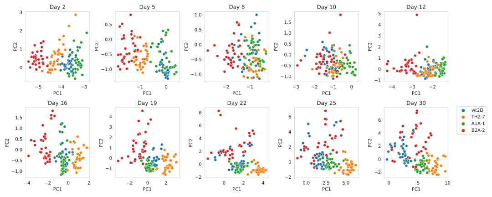

# A large brain organoid dataset reveals extensive improvement potential of state-of-the-art analysis pipelines

This repository reproduces the results of the paper *A large brain organoid dataset reveals extensive improvement potential of state-of-the-art analysis pipelines*.

## Installation
```
git clone https://github.com/deiluca/robust_monitoring_organoid_growth
```
Install conda environment
```
cd path/to/robust_monitoring_organoid_growth
conda env create -f environment.yml
```

Activate the conda environment:

```
conda activate rob_monit_org_growth
```

## Data preparation

Download the data from [Zenodo](https://zenodo.org/records/10301912) and unpack it in data/

## Visualization of results

All results below are generated in [data_analysis.ipynb](data_analysis.ipynb).

### Example of image and corresponding annotation


### Comparison of segmentation performance


### Analysis of predictions


### Comparison of growth monitoring


### Clone diversity



### SegFormer re-training
Please use the [mmsegmentation](https://github.com/open-mmlab/mmsegmentation) repository and the scripts located in [model_training/SegFormer](model_training/SegFormer).

The configuration files `segformer_mit-b0.py`, `schedule_160k.py`, and `default_runtime.py`, referenced in the [training config files](model_training/SegFormer/config_files_training/split-0.py), are available in the [mmsegmentation](https://github.com/open-mmlab/mmsegmentation) repository. These files have not been modified from their original versions.

The data structure required for training the SegFormer model is as follows:
```
images
└── split0_test/
    ├── xxx.jpg
    ├── xxy.jpg
    └── [...]
└── split0_training/
    └── xxz.jpg
    └── [...]
└── split1_test/
    ├── 123.jpg
    └── [...]
└── [...]

masks
└── split0_test/
    ├── xxx_label.tif
    ├── xxy_label.tif
    └── [...]
└── split0_training/
    └── xxz_label.tif
    └── [...]
└── split1_test/
    ├── 123_label.tif
    └── [...]
└── [...]
```
